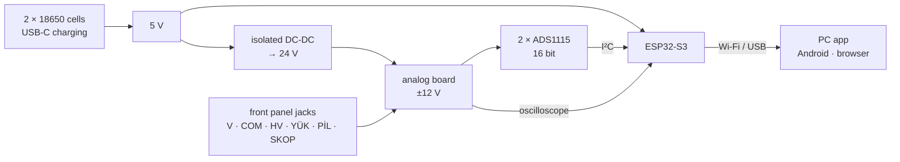

# Ölçüm Kartı

**A DIY bench instrument you use from your phone and your PC.**
Voltmeter · ammeter · wattmeter · energy counter · oscilloscope · battery capacity tester — in one box.

<p align="center">
  
</p>

<p align="center">
  <a href="README.md">Türkçe</a> ·
  <a href="#build-your-own">Build your own</a> ·
  <a href="#apps">Apps</a> ·
  <a href="#quick-start">Quick start</a> ·
  <a href="GELISTIRICI.md">Developer notes</a> ·
  <a href="LICENSE">MIT licence</a>
</p>

The box has no screen. You see the readings over Wi-Fi or USB **in the PC app, the Android app or
straight in a browser**. The board also logs to its own memory: recording continues while your phone
or PC is off, and syncs on its own later.

> The project was built in Turkish: the user guides, the code comments, the engineering journal and the
> labels on the box are in Turkish (YÜK = load, PİL = cell). The app itself has an English option (Settings).

---

## What it does

| | Range | In short |
|---|---|---|
| ⚡ **Voltage** | ±32 V · ±614 V on the high-voltage input | ~500 readings/s, ~1 mV resolution |
| 🔌 **Current** | ±9.5 A | bidirectional, 5 mΩ shunt |
| 💡 **Power and energy** | V × I on every sample | signed power (shows back-feeding), Wh counter |
| 📈 **Oscilloscope** | −63 … +47 V | up to 83 000 samples/s; frequency, duty, Vpp and rise time measured automatically; single-shot trigger, FFT |
| 🔋 **Battery capacity test** | cells and packs up to 38 V | mAh and Wh, discharge curve, cut-off voltage, open-circuit voltage, optional internal resistance |
| 💾 **Logging** | ~11 MB inside the board | survives power loss up to the last moment; name, tags and notes per record |

**Live view** — voltage, current, power and energy on one screen; choose the graph window and refresh rate.


<sub><b>A real measurement:</b> an 18650 cell being connected to and removed from a 3.3 Ω resistor — 3.10 V · 0.875 A · 2.72 W. Blue is voltage, orange is current.</sub>

**Oscilloscope** — shows the waveform and measures frequency, duty cycle and edge times by itself.


<sub><b>A real capture:</b> a 1 kHz / 5 V square wave from an Arduino. Measured by the board: 1.001 kHz, 49.9 % duty, 10 µs rise time.</sub>

**Battery capacity test** — enter the cut-off voltage; the board discharges the cell and disconnects the
load itself when it gets there. The load stays off for the first 5 seconds, so the open-circuit voltage
(OCV) shows up on the graph.


<sub><b>A real measurement:</b> one 18650 cell, 3.3 Ω load (~1.1 A), 2.9 V cut-off → <b>1432 mAh · 5.22 Wh</b> in 1 h 18 min. Blue is voltage, orange is current; the short part at the very start is the OCV phase.</sub>

---

## Apps

The same panel runs in three places: the board's own web page, the **PC app** and the **Android app**.
It has three looks — dark, light and front panel — and Turkish and English text.

### 💻 PC app (Windows)

- Finds the board **over USB or Wi-Fi** by itself; the panel opens at `http://olcum.localhost:8770`.
- **Archives the board's records on your PC** (every 2 minutes); search, names, tags, a recycle bin.
- **Compares** records (up to 6 on one graph) and exports CSV and printable reports.
- No console window, just a tray icon; optionally shows the board's notifications (MQTT) as Windows notifications.

**Compare** — real tests of two 18650 cells on one graph (1366 mAh and 1432 mAh).


**ⓘ Connection** — every screen has an illustrated “which lead goes where” window.

<p align="center">
  
</p>

### 📱 Android app

The PC panel, on your phone: live view, oscilloscope, battery test, records and compare. A copy of the
records stays on the phone; you can **share** files and **print** reports. The phone and the board must be
on the same Wi-Fi network (the phone's own hotspot works too).

<table>
  <tr>
    <td width="33%"></td>
    <td width="33%"></td>
    <td width="33%"></td>
  </tr>
  <tr>
    <td align="center">Live view</td>
    <td align="center">Battery test record</td>
    <td align="center">New battery test</td>
  </tr>
</table>

---

## Build your own

There is **no PCB**: the main board is hand-built on perfboard and the box is made from wooden sticks.
Every step is drawn out in the HTML guides in [`BELGELER/`](BELGELER) (in Turkish).

> **To open the guides:** download the repository (**Code → Download ZIP**) and open
> `BELGELER/index.html` in a browser. GitHub only shows these pages as source code.

| Guide | What's inside |
|---|---|
| [Ne yapabilir](BELGELER/1-ne-yapabilir.html) | every capability and range |
| [Malzemeler](BELGELER/2-malzemeler.html) | every part you need |
| **[Yerleşim](BELGELER/7-yerlesim.html)** | **start here**: solder the perfboard step by step, which part goes in which hole, a check measurement after each step |
| **[Kutu](BELGELER/8-kutu.html)** | the box, panel holes and wiring — every step with a 3D view |
| [Pil testi](BELGELER/3-pil-testi.html) | how to connect a cell, how to read the result |
| [Bağlanma](BELGELER/6-ag.html) | USB, the board's own Wi-Fi, your home network |
| [PC uygulaması](BELGELER/9-pc-uygulamasi.html) | install, pairing, archive, notifications |
| [Şema (PDF)](BELGELER/sema.pdf) | the full schematic |

**Layout guide** — each sub-step highlights only its own parts, with a table of which leg goes in which hole.


**Box guide** — each step shows everything built so far in 3D; rotate it, hover over a part to see its size.

<table>
  <tr>
    <td width="50%"></td>
    <td width="50%"></td>
  </tr>
  <tr>
    <td align="center">Finished box</td>
    <td align="center">Transparent walls: inside and wiring</td>
  </tr>
</table>


**What it looks like for real:**

<table>
  <tr>
    <td width="41%"></td>
    <td width="59%"></td>
  </tr>
  <tr>
    <td align="center">Main board (perfboard)</td>
    <td align="center">Inside the box, lid off</td>
  </tr>
</table>

---

## How it works



- The box runs on **its own cells**. The analog side is fed from an isolated converter, so the measurement
  circuit stays intact while the charging cable is plugged in.
- Two ADS1115s read voltage and current **at the same moment**; the ESP32-S3 computes power, energy and
  capacity on every sample.
- The oscilloscope uses the ESP32's own fast ADC.
- One ESP32 core only measures; the other runs Wi-Fi and the web server, so web traffic never stalls the measurement.

---

## Quick start

1. **Parts and assembly** — the guides above: [Yerleşim](BELGELER/7-yerlesim.html) first, then [Kutu](BELGELER/8-kutu.html).
2. **Flash the firmware** (board: ESP32-S3 **N16R8**, use the board's USB socket marked `COM`):
   ```
   cd uretim
   python yukle.py                                  # build + upload
   python arayuz-uret.py && python arayuz-yaz.py    # write the panel into the board's flash
   ```
   You need `arduino-cli` and the ESP32 core; Arduino IDE settings are in [GELISTIRICI.md](GELISTIRICI.md).
3. **Join your Wi-Fi** — open the serial console at 115200 baud and type `Na<network name>`, then
   `Np<Wi-Fi password>`. The board remembers up to 8 networks; add and pick them later under
   **Settings → Network**. With no known network around, it opens its own (`OLCUM-KARTI-xxxx`, address
   `192.168.4.1`). Details: [Bağlanma](BELGELER/6-ag.html).
4. **Set the web password** — `Ns<password>` on the serial console (at least 12 characters). It protects the
   board's commands and is separate from the Wi-Fi password. Until it is set, anyone on your network can send
   commands to the board.
5. **PC app** — with Python 3 installed, double-click `kopru\PC Baslat.bat`. To pair the PC with the board once
   and add a desktop shortcut: [PC app guide](BELGELER/9-pc-uygulamasi.html).
6. **Android app** — no prebuilt APK is published yet; build it from `mobil/` (Node.js, JDK 17, Android SDK):
   ```
   cd mobil
   npm install
   npm run esitle
   npm run apk        # → android/app/build/outputs/apk/debug/app-debug.apk
   ```
   The app finds the board on the same network; on the **Pair with the board** screen you enter the web
   password once (it is not stored on the phone).

---

## Safety

- **Never connect it to mains (220 V).** The board is not isolated; only measure circuits powered by
  batteries or DC-DC converters.
- High voltage is measured only on the **HV** jack; don't plug USB into a PC while measuring HV.
- When measuring current, **don't clip anything to COM**: inside, COM is tied to YÜK 2 (load) and would bypass the shunt.
- Current: **9.5 A** continuous at most; never exceed **10 A**, not even briefly.
- In a battery test the cell's plus **never goes straight to a PİL (cell) jack**: it goes through the load resistor
  to PİL 1. Don't connect a cell backwards — the board cannot cut that off.
- Details: the **ⓘ Connection** window on every screen and the usage rules in the [box guide](BELGELER/8-kutu.html).

---

## For developers

Every design claim is backed by a runnable test: circuit simulation (ngspice), schematic checks (KiCad), the
firmware's measurement math run inside an AVR emulator, panel, PC bridge and Android tests. **Mutation
testing** checks that the tests really catch faults: the source is broken in a copy and the test must turn red.

```
cd uretim
python dogrula3.py --tam     # the whole verification chain
python mutasyon.py           # do the tests catch broken code?
```

| Folder | What's inside |
|---|---|
| `kod/olcum-karti-a3/` | firmware (ESP32-S3, Arduino) |
| `arayuz3/` · `ortak/` | web panel and shared JS modules |
| `kopru/` | PC app (Python standard library only) |
| `mobil/` | Android app (Capacitor) |
| `sema3/` | KiCad schematic |
| `BELGELER/` | user guides — generated, never edited by hand |
| `uretim/` | verification chain, simulations, document generators |

More: [GELISTIRICI.md](GELISTIRICI.md) (English) · engineering journal [DEVIR.md](DEVIR.md) (Turkish, long).

---

## Licence

[MIT](LICENSE). No warranty: this instrument can measure high voltage — you are responsible for your own safety.
