# Ölçüm Kartı

**Kendin yapabileceğin, telefondan ve bilgisayardan kullanılan bir tezgâh ölçü aleti.**
Tek kutuda voltmetre · ampermetre · wattmetre · enerji sayacı · osiloskop · pil kapasite test cihazı.

<p align="center">
  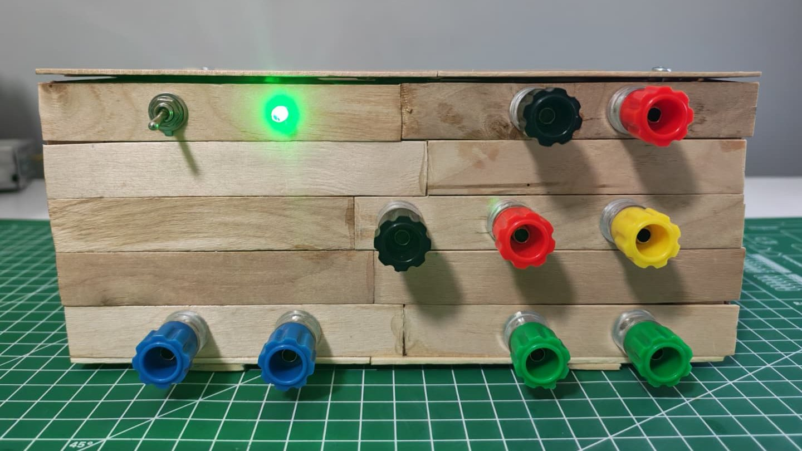
</p>

<p align="center">
  <a href="README.en.md">English</a> ·
  <a href="#kendin-yap">Nasıl yapılır</a> ·
  <a href="#uygulamalar">Uygulamalar</a> ·
  <a href="#hızlı-başlangıç">Hızlı başlangıç</a> ·
  <a href="GELISTIRICI.md">Geliştirici notları</a> ·
  <a href="LICENSE">MIT lisansı</a>
</p>

Kutunun ekranı yok. Ölçümleri Wi-Fi ya da USB üzerinden **PC uygulamasında, Android
uygulamasında ya da doğrudan tarayıcıda** görürsün. Kart ölçtüğünü kendi belleğine de
kaydeder: telefon ya da bilgisayar kapalıyken de kayıt sürer, sonra kendiliğinden eşitlenir.

---

## Ne yapar

| | Menzil | Kısaca |
|---|---|---|
| ⚡ **Gerilim** | ±32 V · yüksek gerilim girişinde ±614 V | saniyede ~500 ölçüm, ~1 mV çözünürlük |
| 🔌 **Akım** | ±9.5 A | iki yönlü, 5 mΩ şönt |
| 💡 **Güç ve enerji** | her örnekte V × I | işaretli güç (geri beslemeyi de görür), Wh sayacı |
| 📈 **Osiloskop** | −63 … +47 V | saniyede 83 000 örneğe kadar; frekans, doluluk, Vpp, yükselme süresi kendiliğinden; tek atış tetikleme, FFT |
| 🔋 **Pil kapasite testi** | 38 V'a kadar piller | mAh ve Wh, deşarj eğrisi, kesme gerilimi, açık devre gerilimi, isteğe bağlı iç direnç |
| 💾 **Kayıt** | kartın içinde ~11 MB | elektrik kesilse bile o ana kadarki kayıt korunur; kayda ad, etiket, not |

**Canlı ölçüm** — gerilim, akım, güç ve enerji aynı ekranda; grafik penceresi ve yenileme hızı seçilebilir.

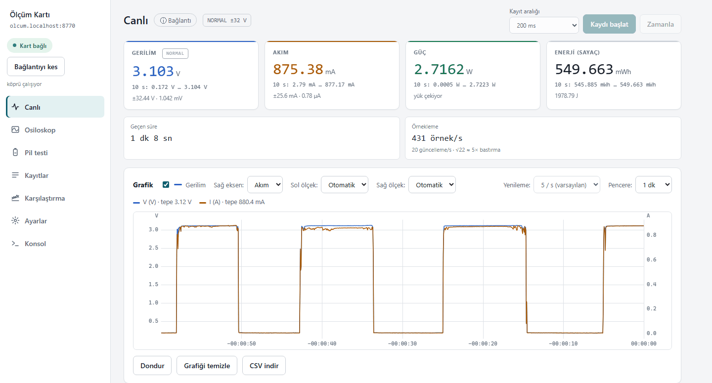

<sub><b>Gerçek ölçüm:</b> bir 18650 hücre 3.3 Ω dirence bağlanıp çıkarılıyor — 3.10 V · 0.875 A · 2.72 W. Mavi gerilim, turuncu akım.</sub>

**Osiloskop** — dalga şeklini gösterir; frekansı, doluluğu ve kenar sürelerini kendisi ölçer.

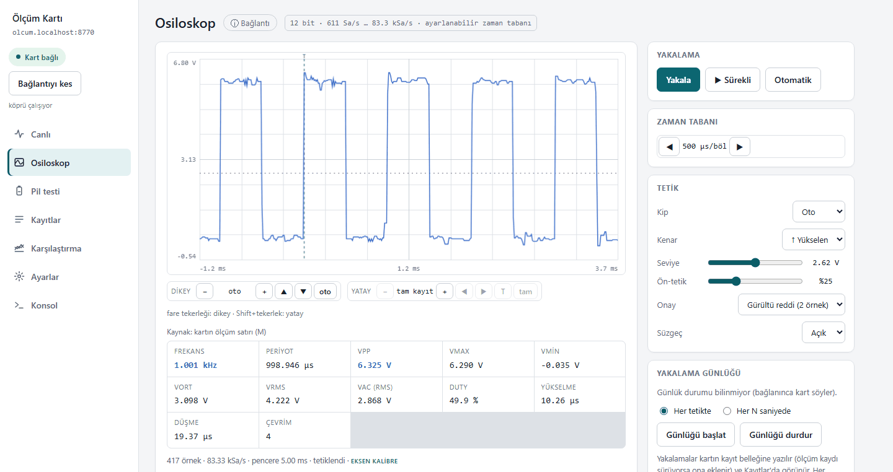

<sub><b>Gerçek yakalama:</b> bir Arduino'nun ürettiği 1 kHz / 5 V kare dalga. Kartın ölçtüğü: 1.001 kHz, doluluk %49.9, yükselme 10 µs.</sub>

**Pil kapasite testi** — kesme gerilimini girersin; kart pili boşaltır, o gerilime inince yükü kendisi keser.
İlk 5 saniye yük kapalıdır, açık devre gerilimi (OCV) grafikte ayrıca görünür.

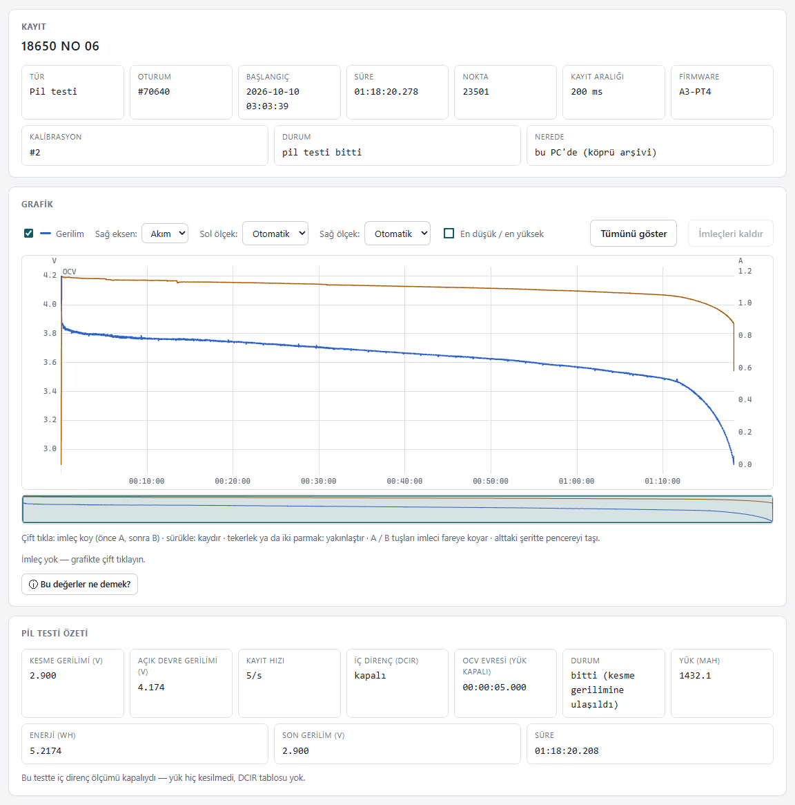

<sub><b>Gerçek ölçüm:</b> bir 18650 hücre, 3.3 Ω yük (~1.1 A), kesme 2.9 V → <b>1432 mAh · 5.22 Wh</b>, 1 saat 18 dakika. Mavi gerilim, turuncu akım; en baştaki kısa bölüm OCV.</sub>

---

## Uygulamalar

Aynı panel üç yerde çalışır: kartın kendi web sayfası, **PC uygulaması** ve **Android uygulaması**.
Üç görünümü var: koyu, açık ve ön panel. Türkçe ve İngilizce.

### 💻 PC uygulaması (Windows)

- Kartı **USB'den ya da Wi-Fi'den** kendisi bulur; panel `http://olcum.localhost:8770` adresinde açılır.
- Kartın kayıtlarını **bilgisayara arşivler** (2 dakikada bir); arama, ad, etiket, çöp kutusu.
- Kayıtları **karşılaştırır** (en çok 6 kayıt aynı grafikte), CSV ve rapor olarak dışa aktarır.
- Konsol penceresi açmaz, bildirim alanında simgesi durur; istersen kartın bildirimlerini (MQTT) Windows bildirimi olarak gösterir.

**Karşılaştırma** — iki 18650 hücrenin gerçek testleri aynı grafikte (1366 mAh ve 1432 mAh).

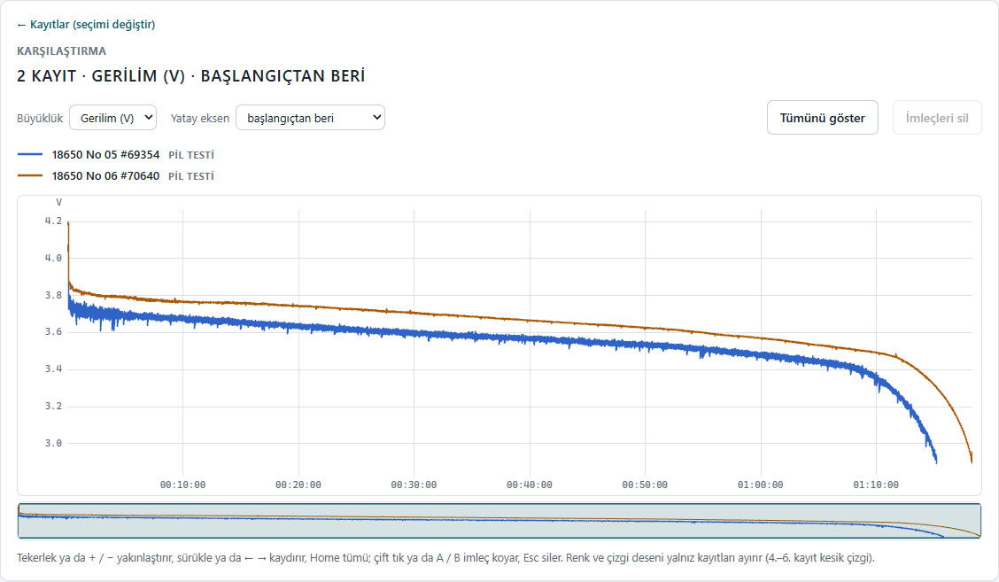

**ⓘ Bağlantı** — her ekranda resimli “hangi kablo hangi jaka” penceresi.

<p align="center">
  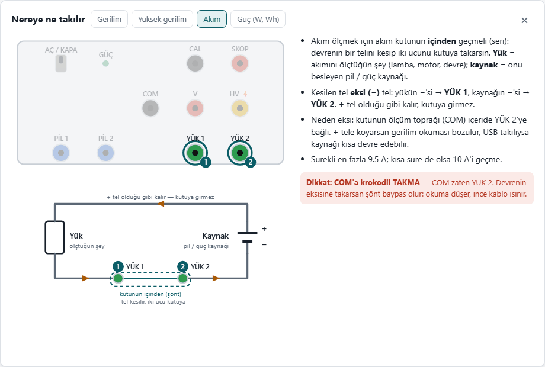
</p>

### 📱 Android uygulaması

PC'deki panelin aynısı telefonda: canlı ölçüm, osiloskop, pil testi, kayıtlar ve karşılaştırma.
Kayıtların bir kopyası telefonda durur; dosyaları **Paylaş** ile gönderebilir, raporu **yazdırabilirsin**.
Telefon ve kart aynı Wi-Fi ağında olmalı (telefonun kendi hotspot'u da olur).

<table>
  <tr>
    <td width="33%">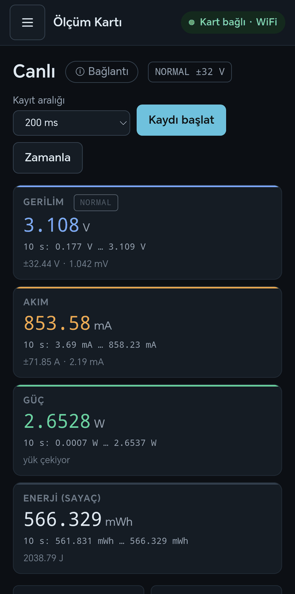</td>
    <td width="33%">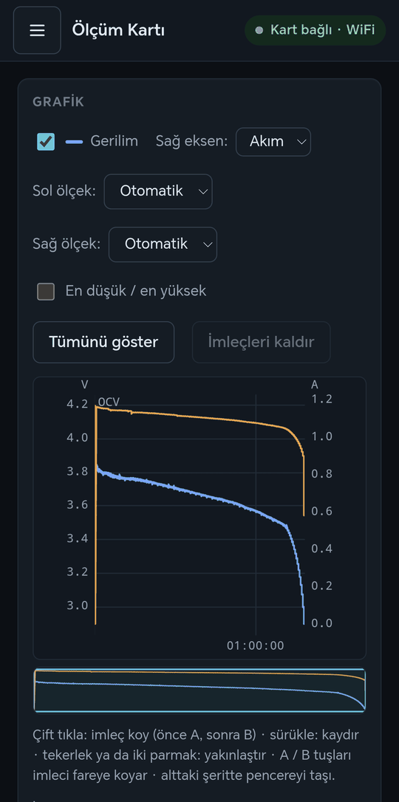</td>
    <td width="33%">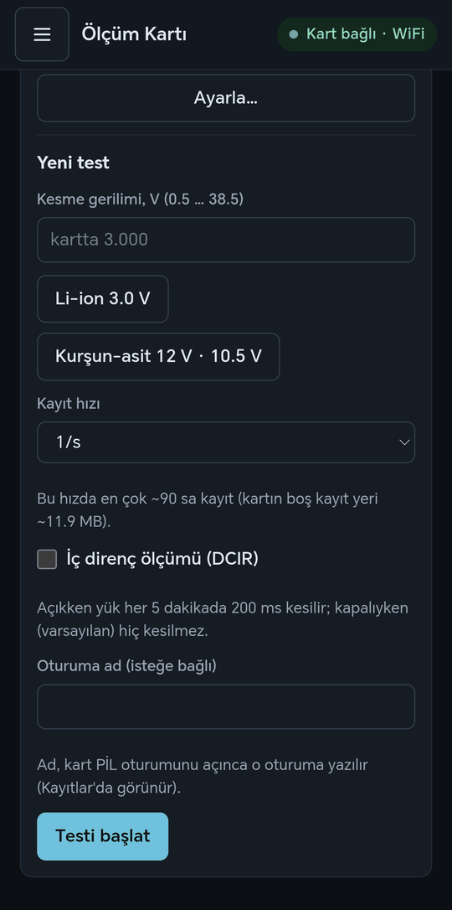</td>
  </tr>
  <tr>
    <td align="center">Canlı ölçüm</td>
    <td align="center">Pil testi kaydı</td>
    <td align="center">Yeni pil testi</td>
  </tr>
</table>

---

## Kendin yap

Bu projede **PCB yok**: ana kart delikli plakete elle kuruluyor, kutu ahşap çubuklardan yapılıyor.
Her adım [`BELGELER/`](BELGELER) klasöründeki HTML rehberlerde **çizimli** anlatılıyor.

> **Rehberleri açmak için:** depoyu indir (**Code → Download ZIP**) ve `BELGELER/index.html` dosyasını
> tarayıcıda aç. GitHub bu sayfaları yalnız kaynak kodu olarak gösterir.

| Rehber | İçinde |
|---|---|
| [Ne yapabilir](BELGELER/1-ne-yapabilir.html) | bütün yetenekler ve menziller |
| [Malzemeler](BELGELER/2-malzemeler.html) | gereken her parça |
| **[Yerleşim](BELGELER/7-yerlesim.html)** | **kurulum buradan başlar**: plakete adım adım lehim, hangi parça hangi deliğe; her adımın sonunda bir kontrol ölçümü |
| **[Kutu](BELGELER/8-kutu.html)** | kutu, panel delikleri, kablolar — her adım 3B görünümlü |
| [Pil testi](BELGELER/3-pil-testi.html) | pil nasıl bağlanır, sonuç nasıl okunur |
| [Bağlanma](BELGELER/6-ag.html) | USB, kartın kendi Wi-Fi'si, ev ağı |
| [PC uygulaması](BELGELER/9-pc-uygulamasi.html) | kurulum, eşleştirme, arşiv, bildirimler |
| [Şema (PDF)](BELGELER/sema.pdf) | devrenin tamamı |

**Yerleşim rehberi** — her alt adımda yalnız o adımın parçaları parlar; altında hangi bacağın hangi deliğe gittiği yazar.

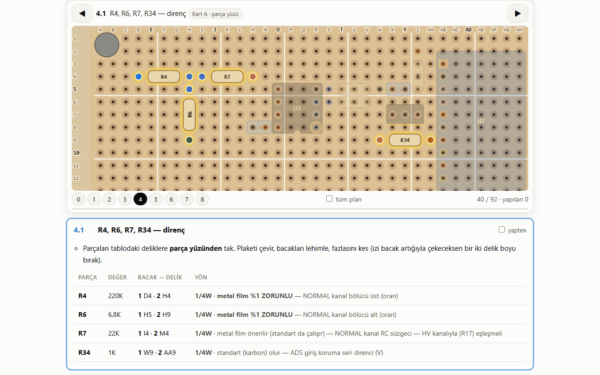

**Kutu rehberi** — her adımda o ana kadar yapılanlar 3B görünür; döndürebilir, parçanın üzerine gelip ölçüsünü görebilirsin.

<table>
  <tr>
    <td width="50%">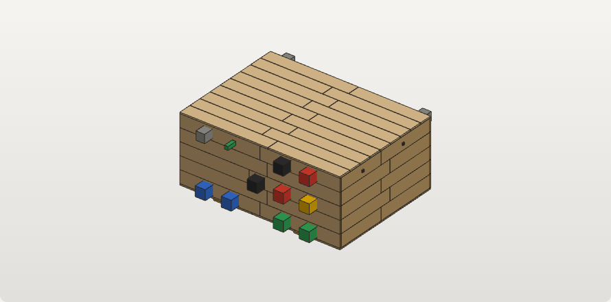</td>
    <td width="50%">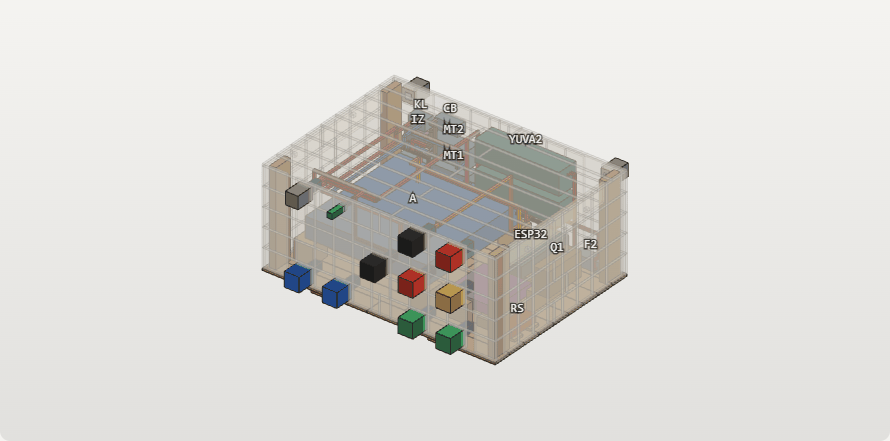</td>
  </tr>
  <tr>
    <td align="center">Bitmiş kutu</td>
    <td align="center">Duvarlar saydam: içi ve kablolar</td>
  </tr>
</table>

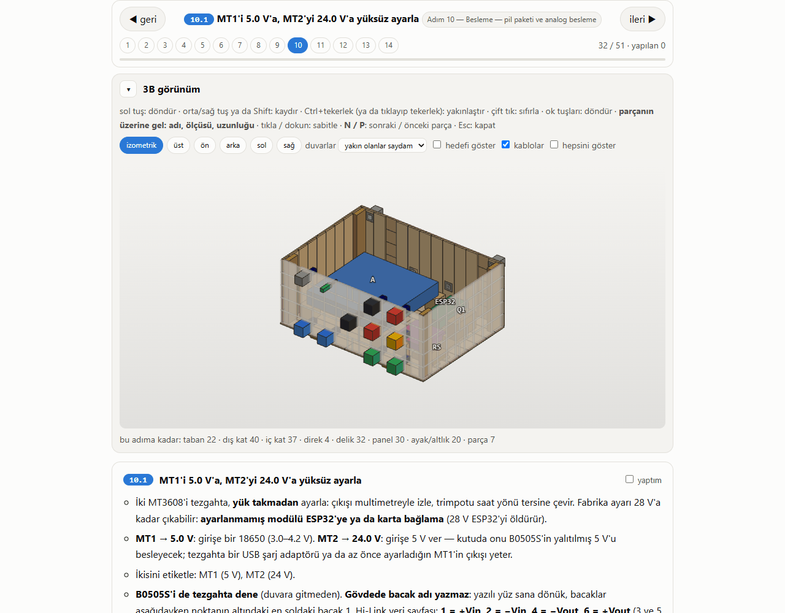

**Gerçekte böyle görünüyor:**

<table>
  <tr>
    <td width="41%">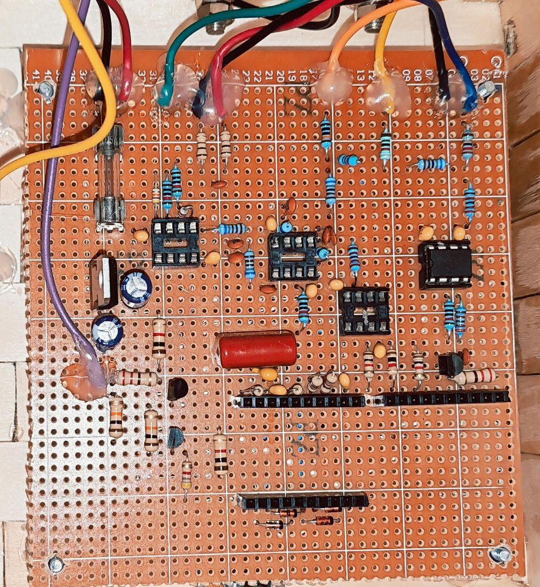</td>
    <td width="59%">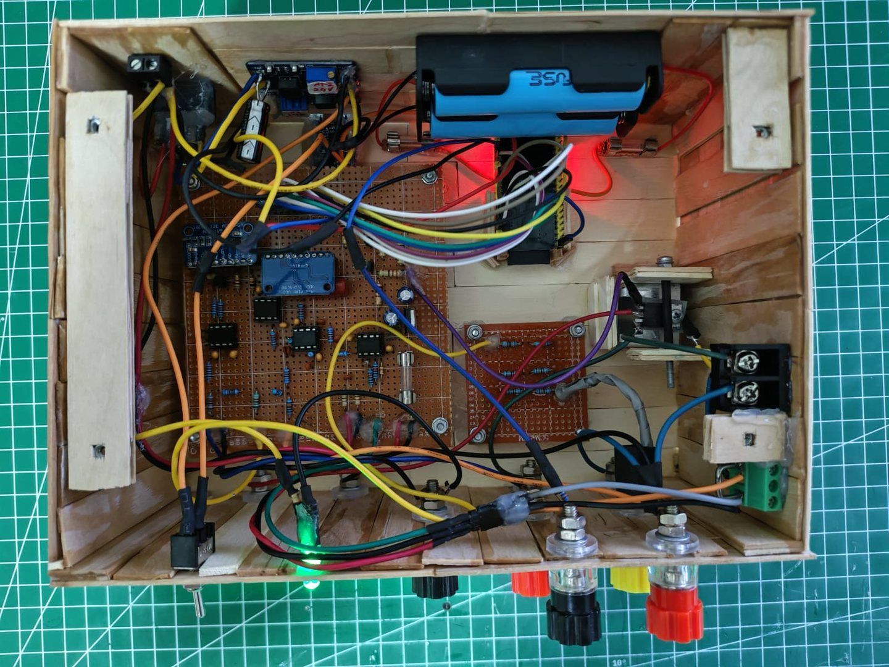</td>
  </tr>
  <tr>
    <td align="center">Ana kart (delikli plaket)</td>
    <td align="center">Kapak açıkken kutunun içi</td>
  </tr>
</table>

---

## İçi nasıl çalışıyor

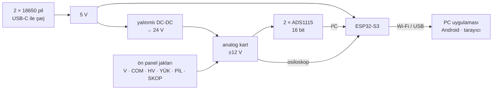

- Kutu **kendi pilleriyle** çalışır. Analog taraf yalıtılmış bir dönüştürücüden beslenir; bu yüzden
  şarj kablosu takılıyken de ölçüm devresi bozulmaz.
- İki ADS1115 gerilimi ve akımı **aynı anda** okur; ESP32-S3 güç, enerji ve kapasiteyi her örnekte hesaplar.
- Osiloskop ESP32'nin kendi hızlı ADC'sini kullanır.
- ESP32'nin bir çekirdeği yalnız ölçer, öbürü Wi-Fi ve web işlerini yürütür; web trafiği ölçümü bekletmez.

---

## Hızlı başlangıç

1. **Malzeme ve kurulum** — yukarıdaki rehberler: önce [Yerleşim](BELGELER/7-yerlesim.html), sonra [Kutu](BELGELER/8-kutu.html).
2. **Firmware'i yükle** (kart: ESP32-S3 **N16R8**, kartın `COM` yazan USB soketi):
   ```
   cd uretim
   python yukle.py                                  # derle + yükle
   python arayuz-uret.py && python arayuz-yaz.py    # paneli kartın belleğine yaz
   ```
   `arduino-cli` ve ESP32 çekirdeği gerekir; Arduino IDE ayarları [GELISTIRICI.md](GELISTIRICI.md)'de.
3. **Ev Wi-Fi'sine tanıt** — seri konsolu 115200 baud ile aç ve yaz: `Na<ağ adı>`, ardından `Np<Wi-Fi parolası>`.
   Kart 8 ağa kadar hatırlar; sonradan panelde **Ayarlar → Ağ**'dan eklenir ve seçilir. Bilinen ağ yoksa
   kart kendi ağını açar (`OLCUM-KARTI-xxxx`, adres `192.168.4.1`). Ayrıntı: [Bağlanma](BELGELER/6-ag.html).
4. **Web parolasını kur** — seri konsolda `Ns<parola>` (en az 12 karakter). Bu parola kartın komutlarını korur
   ve Wi-Fi parolasından ayrıdır. Kurulana kadar ağındaki herkes karta komut gönderebilir.
5. **PC uygulaması** — Python 3 kurulu olsun, `kopru\PC Baslat.bat` dosyasına çift tıkla. Bilgisayarı karta bir kez
   eşleştirmek ve masaüstü kısayolu için: [PC uygulaması rehberi](BELGELER/9-pc-uygulamasi.html).
6. **Android uygulaması** — hazır APK henüz yayınlanmıyor; `mobil/` klasöründen derlenir (Node.js, JDK 17, Android SDK):
   ```
   cd mobil
   npm install
   npm run esitle
   npm run apk        # → android/app/build/outputs/apk/debug/app-debug.apk
   ```
   Uygulama aynı ağdaki kartı bulur; **Kartla eşleştir** ekranında web parolasını bir kez girersin (telefonda saklanmaz).

---

## Güvenlik

- **Şebekeye (220 V) bağlama.** Kart yalıtımlı değil; yalnız pil ve DC-DC ile beslenen devreleri ölç.
- Yüksek gerilim yalnız **HV** jakından ölçülür; HV ölçerken USB'yi bilgisayara takma.
- Akım ölçerken **COM'a krokodil takma**: COM içeride YÜK 2'ye bağlı, şönt baypas olur.
- Akım sürekli en fazla **9.5 A**; kısa süreliğine bile **10 A**'i geçme.
- Pil testinde pilin artısı **doğrudan PİL jakına gitmez**: yük direncinin üstünden PİL 1'e gider. Pili ters bağlama — kart kesemez.
- Ayrıntı: her ekrandaki **ⓘ Bağlantı** penceresi ve [Kutu rehberi](BELGELER/8-kutu.html)'ndeki kullanım kuralları.

---

## Geliştiriciler için

Her tasarım iddiası çalıştırılabilir bir testle sınanıyor: devre benzetimi (ngspice), şema denetimi (KiCad),
firmware'in ölçüm matematiği bir AVR emülatöründe, panel, PC köprüsü ve Android testleri. Testlerin gerçekten
hata yakaladığı **mutasyon testiyle** ölçülüyor: kaynak bir kopyada bozulur, test kırmızıya dönmelidir.

```
cd uretim
python dogrula3.py --tam     # bütün doğrulama zinciri
python mutasyon.py           # testler bozulan kodu yakalıyor mu
```

| Klasör | İçinde |
|---|---|
| `kod/olcum-karti-a3/` | firmware (ESP32-S3, Arduino) |
| `arayuz3/` · `ortak/` | web paneli ve paylaşılan JS modülleri |
| `kopru/` | PC uygulaması (yalnız Python standart kütüphanesi) |
| `mobil/` | Android uygulaması (Capacitor) |
| `sema3/` | KiCad şeması |
| `BELGELER/` | kullanıcı rehberleri — üretiliyor, elle düzenlenmez |
| `uretim/` | doğrulama zinciri, benzetimler, belge üreteçleri |

Ayrıntılar: [GELISTIRICI.md](GELISTIRICI.md) · mühendislik günlüğü [DEVIR.md](DEVIR.md) (Türkçe, uzun).

---

## Lisans

[MIT](LICENSE). Garanti yok: yüksek gerilim ölçebilen bir alet — kendi güvenliğinden sen sorumlusun.
